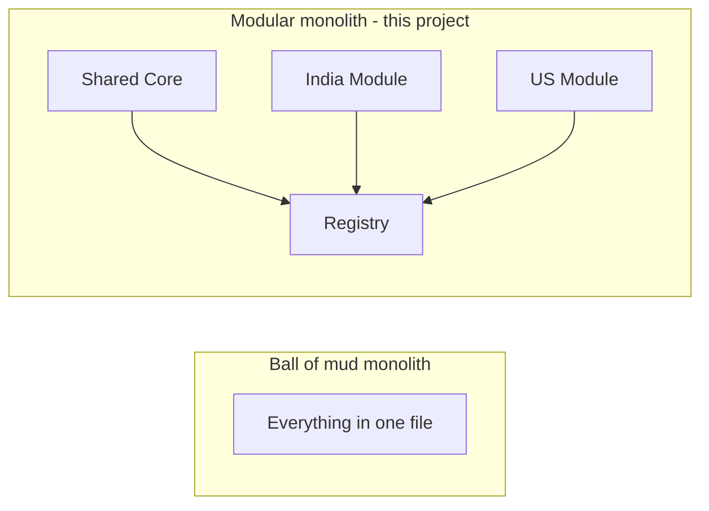
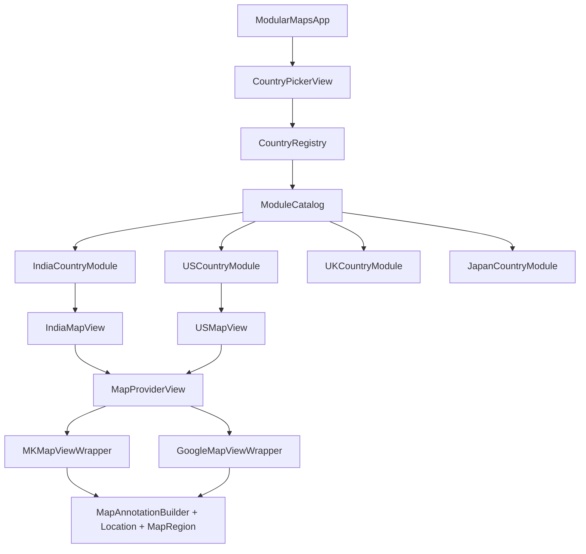

# ModularMaps

Multi-country modular map architecture for iOS — shared core, country-specific UI, and per-region map SDKs (MapKit, Google Maps).

A **system design reference implementation** for a common iOS interview question: how to build map functionality when many country teams share one codebase, ship one App Store app, and still allow different UIs and map frameworks per region.

> **Learning project** — built to explore modular architecture patterns, not as a production map product.

---

## The system design question

> How can you implement map functionality with the following requirements?
>
> - Many developer teams in different countries using a **single codebase**
> - A **single app** on the App Store for all countries
> - **Different map frameworks** in different countries (e.g. MapKit vs Google Maps)
> - **Same business logic** across all versions
> - **Different user interfaces** in different countries
> - Architect the project with all of the above in mind

ModularMaps is one answer: a **modular monolith** with a country module registry, shared map core, adapter-based SDK switching, and per-country presentation modules.

---

## Screenshots

> Add screenshots to [`docs/screenshots/`](docs/screenshots/) and uncomment the section below.

<!--
| Country picker | India (MapKit) | US (Google adapter) |
|:---:|:---:|:---:|
|  |  |  |
-->

**Yes — add screenshots.** They help reviewers and interviewers understand the project in seconds. Capture the country picker plus at least two country maps showing different UI and map providers.

---

## Is "monolith" a bad word?

**No — not always.**

| Term | Meaning | Good or bad? |
|------|---------|--------------|
| **Big ball of mud monolith** | One tangled codebase, no boundaries, everything depends on everything | Bad at scale |
| **Modular monolith** | One deployable app, but **clear internal modules** with defined boundaries | Often the **right choice** |

ModularMaps is intentionally a **modular monolith**:

- **One binary** on the App Store (meets the requirement)
- **One repository** (single codebase)
- **Internal modules** per country team (India, US, UK, Japan)
- **Shared core** for business logic
- **Adapters** at the edges for different map SDKs

You are **not** building a distributed microservices app with four separate App Store listings. That would violate "single app for all countries."

**When teams outgrow folder boundaries**, the next step is Swift Package Manager (SPM) packages per country — still one app, still one repo (or monorepo), but stronger compile-time isolation.



---

## Architecture overview



### Layers

| Layer | Responsibility | Key files |
|-------|----------------|-----------|
| **App** | Entry point | `ModularMapsApp.swift` |
| **Presentation** | SwiftUI screens | `CountryPickerView`, `MapView`, `*MapView` |
| **Registry** | Discover country modules | `CountryRegistry`, `ModuleCatalog` |
| **Configuration** | Per-country data & styling | `*Configuration` |
| **Domain** | Shared models | `Location`, `MapRegion` |
| **Services** | Shared business logic | `MapAnnotationBuilder` |
| **Adapters** | Map SDK integration | `MKMapViewWrapper`, `GoogleMapViewWrapper` |

### What is shared vs per-country

| Concern | Shared | Per-country |
|---------|--------|-------------|
| Location model | Yes | — |
| Annotation building | Yes | — |
| Map region / pins data | — | Yes |
| UI layout & colors | — | Yes |
| Map SDK choice | — | Yes |
| Module registration | — | Yes (`*CountryModule`) |

### Current country modules

| Country | Map SDK | UI notes |
|---------|---------|----------|
| India | MapKit | Red background, 2 buttons |
| US | Google Maps adapter | Pink background, yellow buttons |
| UK | MapKit | Green background, 1 button |
| Japan | MapKit | Indigo background (added via registry) |

---

## Design patterns used

| Pattern | Where | Why |
|---------|-------|-----|
| **Modular monolith** | Project structure | One app, team-owned modules |
| **Registry** | `CountryRegistry` | Dynamic country discovery |
| **Plugin catalog** | `ModuleCatalog` | Single integration point for new countries |
| **Adapter** | `MKMapViewWrapper`, `GoogleMapViewWrapper` | Hide MapKit vs Google behind one interface |
| **Strategy** | `MapProvider` per config | Each country picks its map SDK |
| **Factory** | `CountryModuleRegistrar` | Builds the correct map screen |
| **Configuration** | `*Configuration` | Separate data/styling from views |
| **MVVM** | `MapView` + `MapViewModel` | Thin presentation layer |
| **Bridge** | `UIViewRepresentable` | UIKit maps inside SwiftUI |
| **Protocol-oriented** | `CountryMapConfiguration`, `CustomizableView` | Shared contracts + defaults |

This is **not** strict Clean Architecture. It is a **practical modular design** aligned with the system design question — shared core, frameworks at the boundary, presentation varies by region.

---

## Project structure

```
ModularMaps/
├── ModularMapsApp.swift
└── MapModule/
    ├── Adapters/
    │   ├── MKMapViewWrapper.swift
    │   └── GoogleMapViewWrapper.swift      # stub — see Limitations
    ├── PresentationLayer/
    │   ├── Common/
    │   │   ├── CountryRegistry.swift       # registry + ModuleCatalog
    │   │   ├── MapProvider.swift
    │   │   ├── MapAnnotationBuilder.swift
    │   │   ├── CountryMapConfiguration.swift
    │   │   └── CustomizableView.swift
    │   ├── CountryPickerView.swift
    │   ├── MapView.swift
    │   └── MapViewModel.swift
    └── Subviews/
        ├── IndiaModule/
        ├── USModule/
        ├── UKModule/
        └── JapanModule/
```

Each country module contains:

```
JapanModule/
├── JapanConfiguration.swift    # data, styling, mapProvider
├── JapanMapView.swift          # UI layout
└── JapanCountryModule.swift    # registrar for CountryRegistry
```

---

## Adding a new country

Example: adding France without editing `CountryPickerView`, `MapView`, or `MapViewModel`.

**1. Create the module folder** `MapModule/Subviews/FranceModule/`:

- `FranceConfiguration.swift` — conform to `CountryMapConfiguration`
- `FranceMapView.swift` — country-specific UI
- `FranceCountryModule.swift`:

```swift
enum FranceCountryModule {
    static let registrar = CountryModuleRegistrar(
        identity: CountryIdentity(id: "france", displayName: "France"),
        makeMapScreen: {
            FranceMapView(configuration: FranceConfiguration())
        }
    )
}
```

**2. Register in `ModuleCatalog.bootstrap()`** (one line):

```swift
CountryRegistry.register(FranceCountryModule.registrar)
```

That is the only change outside the France team's folder.

---

## Requirements & setup

- Xcode 16+
- iOS 17+
- Swift 5

### Run

1. Clone the repo
2. Open `ModularMaps.xcodeproj`
3. Select an iPhone simulator
4. **Run** (⌘R)
5. Pick a country → **Open Map**

### Signing

If you see provisioning warnings, open **Signing & Capabilities** on the ModularMaps target and enable **Automatically manage signing** with your Apple ID team. Simulator builds do not require a physical device profile.

---

## Limitations (honest scope)

This is a **learning / interview reference**, not production-ready:

| Item | Current state |
|------|----------------|
| Google Maps | Adapter **stub** — uses MapKit with hybrid style + badge; real `GMSMapView` not integrated |
| Module boundaries | Folder-based; not yet SPM packages |
| Auth / login | Separate project by design — not included here |
| Tests | Not included (learning scope) |
| Localization | English only |
| Remote config | Country chosen in-app, not from server/locale |

Being upfront about these limits in interviews shows maturity.

---

## Possible improvements (no tests required)

If you want to take this further for learning:

1. **Real Google Maps SDK** for the US module (API key via `xcconfig`, not committed)
2. **SPM packages** — `ModularMapsCore`, `IndiaFeature`, `USFeature`, etc.
3. **Architecture diagram image** in README (export from Mermaid or draw.io)
4. **Screenshots** in `docs/screenshots/` (highly recommended for GitHub)
5. **App shell doc** — how a separate Login project would pass `CountryIdentity` into this module
6. **`CODEOWNERS`** file — show how teams own country folders on GitHub
7. **Replace `AnyView`** in registry with `@ViewBuilder` generics if you want to avoid type erasure
8. **Locale-based default country** instead of always defaulting to first in list

---

## Related projects

| Project | Role |
|---------|------|
| **ModularMaps** (this repo) | Map feature — country modules, adapters, shared core |
| **Login / Auth module** (separate) | Authentication — composed with this at ship time into one App Store app |

---

## License

MIT License — see [LICENSE](LICENSE).

---

## Author

**Gagan Joshi**

Built as a system design exercise for multi-country iOS map architecture.
