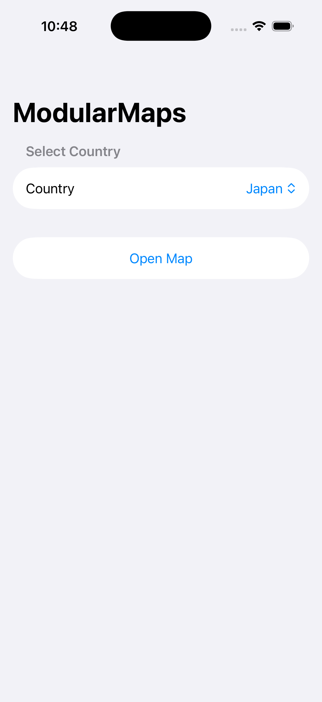
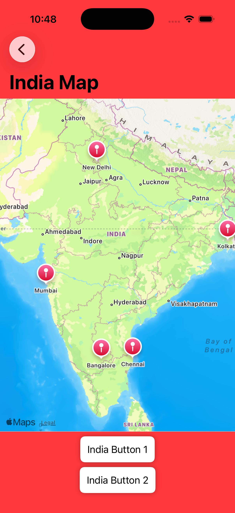
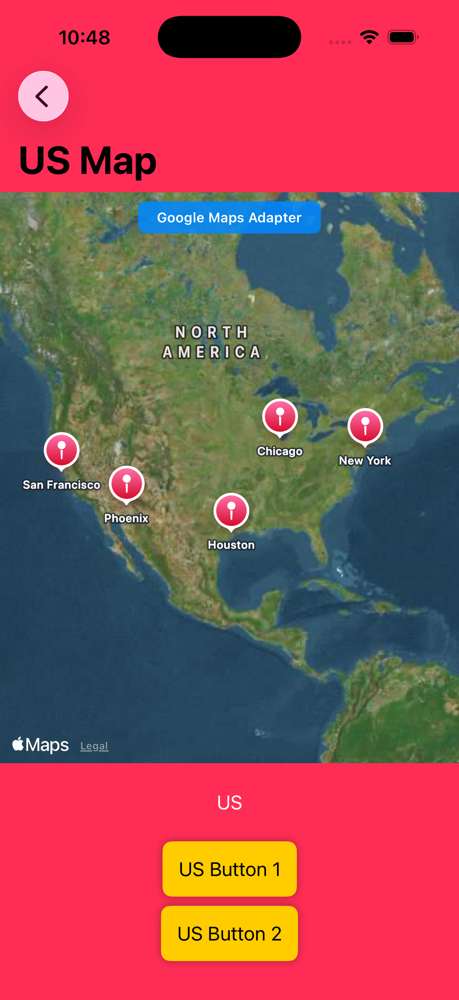
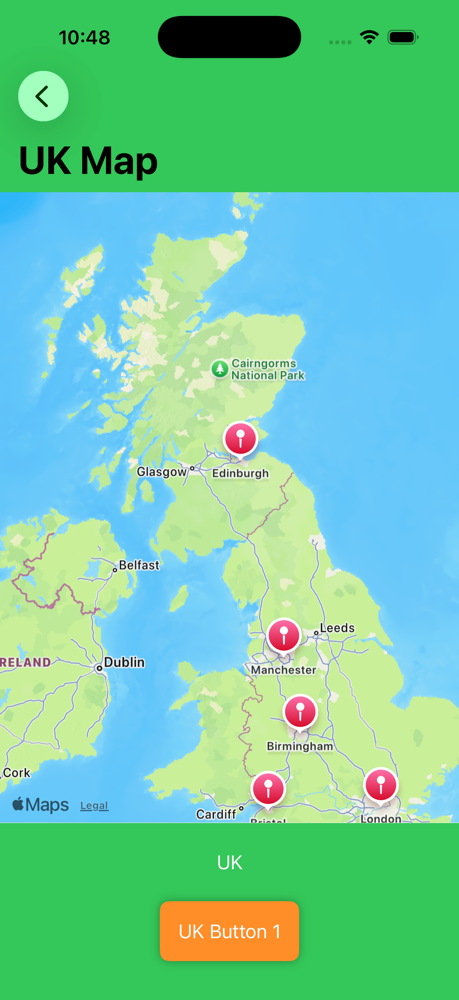
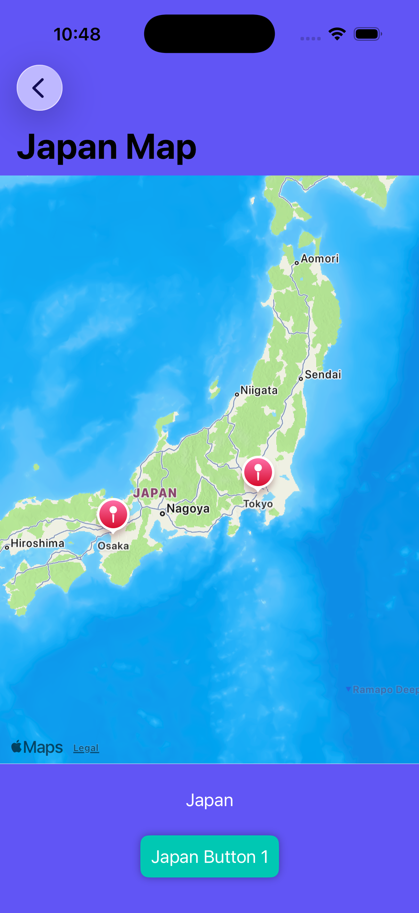

# ModularMaps

Multi-country modular map architecture for iOS — shared core, country-specific UI, and per-region map SDKs (MapKit, Google Maps).

A **system design reference** for building one App Store app where many country teams share a codebase, reuse the same map logic, but ship different UI and map frameworks per region.

---

## Screenshots

| Country picker | India (MapKit) | US (Google adapter) |
|:---:|:---:|:---:|
|  |  |  |

| UK (MapKit) | Japan (registry demo) |
|:---:|:---:|
|  |  |

---

## The problem

- One codebase, many country teams  
- One App Store app  
- Same map business logic everywhere  
- Different UI per country  
- Different map SDK per country (MapKit vs Google Maps)

## The approach

**Modular monolith** — one app, internal modules per country, not separate apps per region.

```
CountryPicker → CountryRegistry → Country Module → MapProviderView → MapKit / Google adapter
                                        ↓
                              Shared core (Location, MapRegion, MapAnnotationBuilder)
```

| Shared | Per country |
|--------|-------------|
| Location model, annotation builder | UI layout & colors |
| Map adapters, registry | Region, pins, map SDK choice |

**Patterns:** Registry, Adapter, Strategy, Configuration, MVVM, `UIViewRepresentable` bridge.

---

## Project layout

```
MapModule/
├── Adapters/              MKMapViewWrapper, GoogleMapViewWrapper
├── PresentationLayer/     CountryPickerView, MapView, CountryRegistry
└── Subviews/
    ├── IndiaModule/       Configuration + MapView + CountryModule
    ├── USModule/
    ├── UKModule/
    └── JapanModule/
```

Each country folder has three files: `*Configuration`, `*MapView`, `*CountryModule`.

---

## Add a country

1. Create `MapModule/Subviews/FranceModule/` with config, view, and registrar.  
2. Register in `ModuleCatalog.bootstrap()`:

```swift
CountryRegistry.register(FranceCountryModule.registrar)
```

Do not edit `CountryPickerView`, `MapView`, or `MapViewModel`.

---

## Run

1. Open `ModularMaps.xcodeproj`  
2. Select an iPhone simulator → **Run** (⌘R)  
3. Pick a country → **Open Map**

**Requires:** Xcode 16+, iOS 17+

---

## License

**Proprietary — all rights reserved.** See [LICENSE](LICENSE).

You may view and run for personal, non-commercial evaluation only with permission. Copying, modifying, distributing, or commercial use is not permitted without written consent from Gagan Joshi.

---

**Gagan Joshi** — system design exercise for multi-country iOS map architecture.
